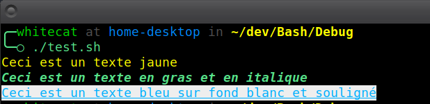

# Chroma
**Module de formatage de texte pour terminal avec support des couleurs ANSI 256 et des styles avancés.**

---

## 🎯 **Fonctionnalités**
- **Couleurs du texte** (foreground) et de fond (background).
- **Styles avancés** : gras, italique, souligné, clignotant, etc.
- **Flexibilité** : Utilisation des noms de couleurs prédéfinis ou des IDs numériques pour les codes ANSI 256.
- **Facilité d’utilisation** : Combinaison rapide des styles, couleurs et formatage.

---

## 🚀 **Utilisation**

### 1. **Ajouter des couleurs**

**Syntaxe** :
```bash
Chroma_coloration "Texte" "couleur_foreground" "couleur_background"
```

**Exemple** :
````Bash
Chroma_coloration "Ceci est un texte rouge sur fond noir" "red" "black"
````

### 2. **Appliquer des styles**

**Syntaxe** :
```Bash
Chroma_font_style "Texte" "style1" "style2"
```

**Exemple** :
```Bash
Chroma_font_style "Texte en gras et souligné" "bold" "underline"
```

### 3. **Combiner couleurs et styles**

**Syntaxe** :
```Bash
Chroma_stylize "Texte" [--fg "couleur_foreground"] [--bg "couleur_background"] [--styles "style1" "style2"]
```

**Exemple** :
```Bash
Chroma_stylize "Texte stylisé" --fg "cyan" --bg "black" --styles "bold" "underline"
```

## 🎨 **Couleurs et Styles Disponibles**
Pour afficher les couleurs et styles disponibles dans le terminal :

```Bash
./Chroma.sh --colors
./Chroma.sh --styles
```

**Couleurs disponibles** :
black, red, green, yellow, blue, purple, cyan, orange, white.

**Styles disponibles** : bold, dim, italic, underline, blink, overline.

## 📄 **Exemple Complet**
```Bash
#!/bin/bash
. chemin/vers/Nexus.sh
Nexus_link_with Chroma

# Exemple 1 : Texte coloré
Chroma_coloration "Ceci est un texte jaune" "yellow"

# Exemple 2 : Texte avec styles
Chroma_font_style "Ceci est un texte en gras et en italique" "bold" "italic"

# Exemple 3 : Texte combiné
Chroma_stylize "Ceci est un texte bleu sur fond blanc et souligné" --fg "blue" --bg "white" --styles "underline"
```



## ⚙️ **Architecture interne**
Le module fonctionne grâce à :

- Couleurs prédéfinies : Mappées aux codes ANSI 256.
- Gestion dynamique des styles et des couleurs via Chroma_get_compiled_* et Chroma_get_formatted_string.
- Validation robuste : Vérifie les entrées pour éviter les erreurs.

## 🛠️ **Utilisation d'une couleur personnalisée**
Pour utiliser une couleur personnalisée (ID 0-256), utilisez directement son code numérique :

```Bash
Chroma_coloration "Texte couleur personnalisée" "123" "45"
```

## © **Licence**
Ce module fait partie de WhiteBash, distribué sous licence MIT.