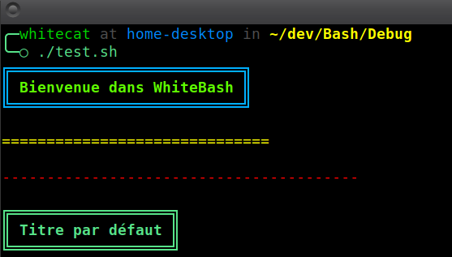

# **FrameGen**
**Module pour générer des titres encadrés et des lignes horizontales personnalisées avec symboles et options de couleur.**

---

## 🎯 **Fonctionnalités principales**
- **Titres encadrés** : Encadrez vos titres avec des bordures stylisées et des options de couleur.
- **Lignes horizontales personnalisées** : Génération de séparateurs avec symboles personnalisables et coloration optionnelle.
- **Symboles modulables** : Configuration des bordures via des symboles pré-définis.

---

## 🛠️ **Prérequis**
- **Dépendances internes** : `Chroma`, `WShield`, `StrOps`. 

## 🚀 **Utilisation**

### 1. **Générer un titre encadré**

**Syntaxe** :
```Bash
FrameGen_generate_title "titre" [couleur_titre] [couleur_bordure]
```

**Exemple** :
```Bash
FrameGen_generate_title "Mon Titre" "cyan" "yellow"
```

### 2. **Générer une ligne horizontale**

**Syntaxe** :
```Bash
FrameGen_get_horizontal_line longueur [symbole] [couleur]
```

**Exemple** :
```Bash
FrameGen_get_horizontal_line 20 "-" "red"
```

## 🎓 **Exemple Complet**

```Bash
#!/bin/bash

# Chargement de Nexus et des modules requis
. chemin/vers/Nexus/Nexus.sh
Nexus_link_with FrameGen

# Titre encadré avec couleurs
FrameGen_generate_title "Bienvenue dans WhiteBash" "green" "blue"

# Séparateurs personnalisés
echo
FrameGen_get_horizontal_line 30 "=" "yellow"

echo
FrameGen_get_horizontal_line 40 "-" "red"

# Titre par défaut sans couleur
echo
FrameGen_generate_title "Titre par défaut"
```



## ⚙️ **Symboles de Bordure**
Les symboles utilisés pour générer les bordures sont définis dans FRAMEGEN_SYMBOLS. 

Vous pouvez les personnaliser si besoin :

```Bash
declare -grA FRAMEGEN_SYMBOLS=(
    ['border_x']='═'
    ['border_y']='║'
    ['corner_tl']='╔'
    ['corner_tr']='╗'
    ['corner_bl']='╚'
    ['corner_br']='╝'
)
```

## ⚠️ **Notes Importantes**
- Les longueurs doivent être des nombres positifs, vérifiés grâce à WShield.
- La coloration des symboles utilise le module Chroma.

## 📈 **Évolutions à venir**
Ce module est en constante évolution. Des fonctionnalités comme la génération de tableaux et des séparateurs avancés sont en cours de réflexion.

## © **Licence**
Ce module fait partie du framework WhiteBash, distribué sous licence MIT.