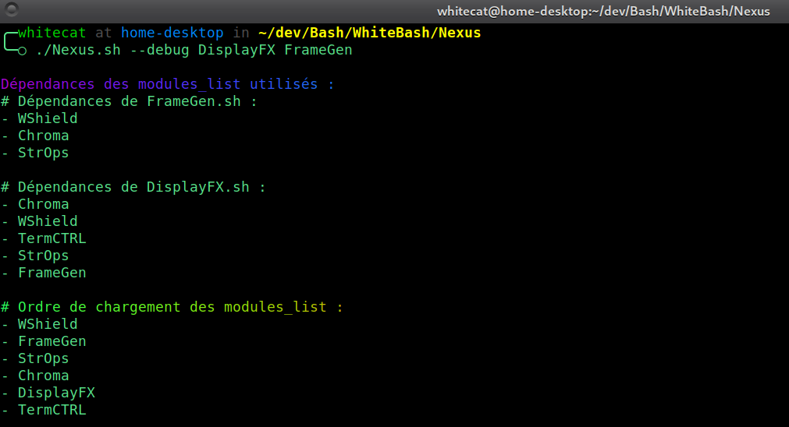
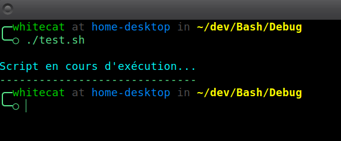

# Nexus
**Gestionnaire central de WhiteBash permettant le chargement automatisé des modules avec gestion des dépendances.**

---

## 🔍 **Qu'est-ce que Nexus ?**
Nexus est le **cœur** du framework **WhiteBash**. Il est responsable de :
- Sourcer les modules nécessaires.
- Résoudre les dépendances déclarées par chaque module.
- Charger les modules dans le bon ordre pour assurer leur bon fonctionnement.

Grâce à Nexus, vous n'avez plus besoin de gérer manuellement les dépendances entre modules.

---

## 🎯 **Fonctionnalités clés**
- **Résolution des dépendances** : Vérifie et charge automatiquement les dépendances nécessaires pour chaque module.
- **Gestion des modules** : Possibilité de charger **tous les modules** ou uniquement les modules nécessaires.
- **Cache intelligent** : Optimise le temps de chargement en conservant l'ordre des dépendances dans un cache.
- **Mode debug** : Affiche les dépendances et l'ordre de chargement pour le débogage.

---

## 🛠️ **Installation et Préparation**
Nexus est inclus avec WhiteBash. Aucune installation spécifique n’est nécessaire.

## 🚀 **Utilisation de Nexus**

```Bash
# Sourcing de Nexus
. chemin/vers/Nexus/Nexus.sh  

# Charger tous les modules
Nexus_link

# Charger uniquement certains modules (et leurs dépendances)
Nexus_link_with DisplayFX FrameGen
```

## 🔍 **Mode Debug**
Pour vérifier les dépendances et l’ordre de chargement des modules, utilisez le mode debug.

```Bash
./Nexus/Nexus.sh --debug DisplayFX FrameGen
```

Résultat :



## 🧩 **Ajouter une dépendance à un module**
Dans chaque module, les dépendances sont déclarées avec la ligne suivante :

```Bash
# Nexus_dependencies : Chroma WShield
```

Nexus détectera automatiquement cette ligne pour résoudre et charger les dépendances avant le module.

## 📦 **Gestion du Cache**
Nexus utilise un cache pour optimiser le chargement des dépendances.

Le fichier cache est stocké dans : Nexus/cache/<nom_du_script>.cache

Vous pouvez nettoyer manuellement le contenu du cache :

```Bash
./Nexus/.Cache --clear
```

## 📄 **Logs et Débogage**
Les journaux d'exécution sont enregistrés dans : Nexus/logs/Nexus.log

Vous y trouverez des informations sur les éventuelles erreurs de dépendances manquantes.

## ⚠️ **Notes Importantes**
Nexus doit être sourcé et non exécuté directement.

**Exemple correct :** . chemin/vers/Nexus/Nexus.sh

**Exemple incorrect :** bash Nexus/Nexus.sh

## 🎓 **Exemple Complet**
Voici un script d'exemple qui utilise Nexus pour charger les modules DisplayFX et FrameGen.

```Bash
#!/bin/bash

# Chargement de Nexus et des modules nécessaires
. chemin/vers/Nexus.sh
Nexus_link_with DisplayFX FrameGen

message="Script en cours d'exécution..."

# Exemple d'utilisation
DisplayFX_message "info" "$message" 1 0
FrameGen_get_horizontal_line "${#message}" "-"
```

Résultat :



## 🛠️ **Maintenance**
Le système de cache est autonome et régulera ses fichiers internes par lui-même.

Toutefois, si vous souhaitez purger le contenu du cache pour une quelconque raison :

```Bash
./Nexus/.Cache --clear
```


## © **Licence**
Nexus est inclus dans WhiteBash, distribué sous licence MIT.
