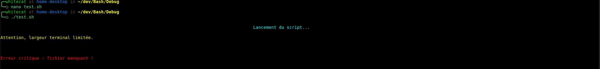

# WhiteBash
**Framework Bash modulaire pour simplifier et accélérer le développement de scripts en apportant des solutions réutilisables pour les besoins généraux.**

---

## 🔍 **Qu'est-ce que WhiteBash ?**
WhiteBash est un framework en **Bash** conçu pour éviter de "réinventer la roue". Il fournit des **modules réutilisables** pour automatiser des tâches récurrentes.

Plutôt que de ressaisir du code générique (gestion du texte, chaînes de caractères, terminal, etc.), **WhiteBash** vous permet d’appeler des fonctions prêtes à l’emploi pour vous concentrer uniquement sur la logique de votre script principal.

---

## 🎯 **Objectif**
- Fournir des **fonctions réutilisables** pour les développeurs Bash.
- Simplifier la création de scripts en résolvant les besoins courants.
- Assurer une gestion des dépendances entre modules via **Nexus**, le cœur du framework.

---

## 🧩 **Modules disponibles**

| **Nom du Module** | **Description**                                                                              |
|-------------------|----------------------------------------------------------------------------------------------|
| `Chroma`          | Gère le formatage du texte avec les codes ANSI.                                              |
| `DisplayFX`       | Affiche du texte stylisé, des titres, des bannières.                                         |
| `FrameGen`        | Génère des titres encadrés et des séparateurs horizontaux.                                   |
| `StrOps`          | Applique des modifications sur des chaînes de caractères.                                    |
| `TermCTRL`        | Contrôle avancé du terminal : retourne la largeur, vérifie des seuils, et génère des ratios. |
| `WShield`         | Dispose de fonctions pour vérifier du contenu.                                               |

---

## 🛠️ **Installation**

Clonez le dépôt et donnez les droits d'exécution :

```bash
# Clonez le projet
git clone https://github.com/whitecat/WhiteBash.git  

# Copiez le framework dans dans votre projet
cp -r chemin/vers/WhiteBash chemin/vers/projet
```

## 🚀 **Utilisation**

```Bash
# Sourcing de Nexus dans le script
. chemin/vers/Nexus/Nexus.sh

# Première option : Charger tous les modules
Nexus_link  

# Seconde option : Charger des modules spécifiques
Nexus_link_with DisplayFX FrameGen
```

## ⚙️ **Exemple concret**

Imaginons un script dans lequel vous avez besoin d'afficher des messages d’erreur, d’avertissement et d’information.

```Bash
# Chargement des modules nécessaires
. chemin/vers/Nexus/Nexus.sh
Nexus_link_with DisplayFX

# Exemple d'utilisation du module DisplayFX
DisplayFX_message "info" "Lancement du script..." 1 0 center  
DisplayFX_message "warning" "Attention, largeur terminal limitée." 1 1  
DisplayFX_message "error" "Erreur critique : fichier manquant !" 2 2 
```

Résultat :



## 🔗 **Ajouter un nouveau module**

Créer un module est simple :

1. Ajoutez un nouveau fichier .sh dans WhiteBash.
2. Précisez les dépendances nécessaires en utilisant :
```Bash
# Nexus_dependencies : Dépendance1 Dépendance2 ...
```

Nexus s’occupera de vérifier les dépendances et de les sourcer dans le bon ordre.

## 📄 **Documentation**
Pour chaque module, une documentation détaillée sera disponible dans le répertoire docs/.

## ⚠️ **Limites et évolutivité**
WhiteBash est conçu pour évoluer. Cependant, les modules étant en constante évolution, aucune rétrocompatibilité ne peut être garantie pour les futures versions.

## © **Licence**
WhiteBash est distribué sous licence MIT.