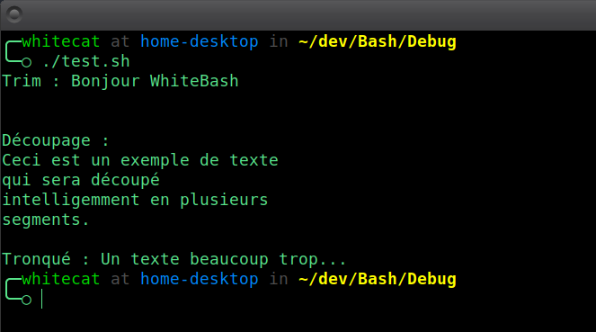

# **StrOps**
**Module pour manipuler et transformer les chaînes de caractères : trim, découpe et troncature.**

---

## 🎯 **Fonctionnalités principales**
- **Trim** : Retire les espaces aux extrémités d’une chaîne (gauche, droite ou les deux).
- **Découpage intelligent** : Coupe une chaîne en segments de taille définie sans briser les mots.
- **Troncature** : Tronque une chaîne trop longue en ajoutant automatiquement `...` à la fin.

---

## 🚀 **Utilisation**

### 1. **Retirer les espaces (Trim)**

**Syntaxe** :
```bash
StrOps_trim "chaîne" [côtés_ciblés=both]
```

**Exemple** :
```Bash
StrOps_trim "   Bonjour le monde   "          # "Bonjour le monde"
StrOps_trim "   Bonjour le monde   " left     # "Bonjour le monde   "
StrOps_trim "   Bonjour le monde   " right    # "   Bonjour le monde"
```

### 2. **Découper une chaîne (Split)**

**Syntaxe** :
```Bash
StrOps_split "chaîne" longueur_max tableau_de_référence
```

**Exemple** :
```Bash
texte="Ceci est une longue chaîne de texte pour démontrer le découpage"
StrOps_split "$texte" 20 result

# Affiche les segments
for line in "${result[@]}"; do
    echo "$line"
done
```

### 3. **Tronquer une chaîne (Truncate)**

**Syntaxe** :
```Bash
StrOps_truncate "chaîne" longueur_max
```

**Exemple** :
```Bash
texte="Ceci est une longue chaîne de texte"
StrOps_truncate "$texte" 20
```

## 🎓 **Exemple Complet**

```Bash
#!/bin/bash

# Chargement de Nexus et des modules nécessaires
. chemin/vers/Nexus/Nexus.sh
Nexus_link_with StrOps

# Trim
echo -e "Trim : $(StrOps_trim "   Bonjour WhiteBash   ")\n"

# Split
texte="Ceci est un exemple de texte qui sera découpé intelligemment en plusieurs segments."
StrOps_split "$texte" 30 result

echo -e "\nDécoupage :"
for line in "${result[@]}"; do
    echo "$line"
done

# Truncate
texte="Un texte beaucoup trop long pour rentrer ici"
echo -e "\nTronqué : $(StrOps_truncate "$texte" 25)"
```



## ⚠️ **Notes Importantes**
- `StrOps_split` utilise awk pour préserver les mots lors du découpage.
- Les longueurs maximales sont strictement respectées, avec gestion propre des espaces et des limites.

## 📈 **Évolutions à venir**
D’autres fonctionnalités comme la recherche/remplacement, la concaténation ou des regex simplifiées viendront enrichir ce module.

## © **Licence**
Ce module fait partie du framework WhiteBash, distribué sous licence MIT.