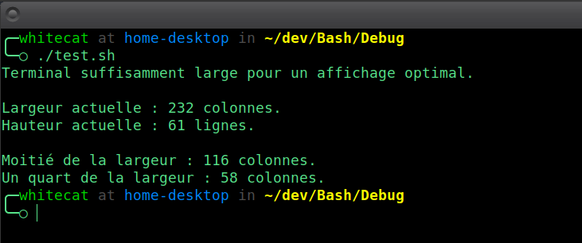

# **TermCTRL**
**Module pour la gestion des propriétés du terminal, comme la largeur, la hauteur et les ratios dynamiques.**

---

## 🎯 **Fonctionnalités principales**
- **Vérification de la largeur minimale** : S’assure que le terminal est assez large pour l'affichage.
- **Largeur et hauteur dynamiques** : Récupère la largeur et la hauteur du terminal en colonnes et lignes.
- **Calcul de ratios** : Retourne des dimensions proportionnelles basées sur la largeur du terminal.

---

## 🚀 **Utilisation**

### 1. **Vérifier la largeur minimale**

**Syntaxe** :
```bash
TermCTRL_is_quite_wide "largeur_minimum"
```

**Exemple** :
```Bash
if TermCTRL_is_quite_wide 80; then
    echo "Terminal suffisamment large pour afficher le contenu."
else
    echo "Attention : La largeur du terminal ne correspond pas aux besoins !"
fi
```

### 2. **Récupérer les dimensions du terminal**

**Syntaxe** :
```Bash
# Récupère la largeur actuelle du terminal (en colonnes)
TermCTRL_get_width

# Récupère la longueur actuelle du terminal (en lignes)
TermCTRL_get_height
```

**Exemple** :
```Bash
# Récupérer et afficher la largeur
echo "Largeur actuelle : $(TermCTRL_get_width) colonnes."

# Récupérer et afficher la hauteur
echo "Largeur actuelle : $(TermCTRL_get_height) lignes."
```

### 3. **Calculer un ratio dynamique**

**Syntaxe** :
```Bash
TermCTRL_get_ratio "numérateur" "dénominateur"
```

- Numérateur : Valeur à appliquer pour le calcul.
- Dénominateur : Base de division pour déterminer le ratio.

**Exemple** :
```Bash
echo "Un tiers de la largeur du terminal est : $(TermCTRL_get_ratio 1 3) colonnes."
```

## 🎓 **Exemple Complet**

````Bash
#!/bin/bash

# Chargement de Nexus et du module TermCTRL
. chemin/vers/Nexus/Nexus.sh
Nexus_link_with TermCTRL

# Vérification de la largeur minimale
if TermCTRL_is_quite_wide 100; then
    echo "Terminal suffisamment large pour un affichage optimal."
else
    echo "Terminal trop étroit, contenu limité."
fi

echo

# Dimensions actuelles
echo "Largeur actuelle : $(TermCTRL_get_width) colonnes."
echo "Hauteur actuelle : $(TermCTRL_get_height) lignes."

echo

# Calcul de ratios dynamiques
echo "Moitié de la largeur : $(TermCTRL_get_ratio 1 2) colonnes."
echo "Un quart de la largeur : $(TermCTRL_get_ratio 1 4) colonnes."
````



## ⚠️ **Notes Importantes**
- Les valeurs retournées par `TermCTRL_get_ratio` sont toujours arrondies à l'entier inférieur pour éviter les erreurs d’affichage.
- Le module utilise tput (cols et lines), une commande native pour interagir avec le terminal. Assurez-vous qu’elle est disponible sur votre système.

## 📈 **Évolutions à venir**
Des fonctionnalités avec des calculs avancés pour des mises en page adaptatives selon la largeur et hauteur.

## © **Licence**
Ce module fait partie du framework WhiteBash, distribué sous licence MIT.