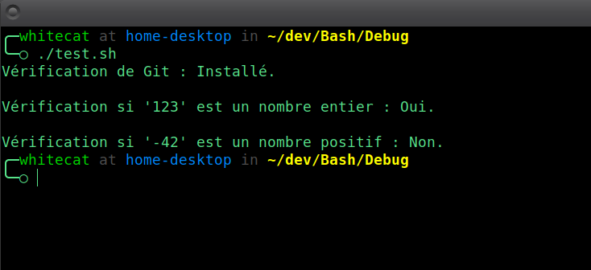

# **WShield**
**Module de vérification pour valider la présence de paquets et les types de données.**

---

## 🎯 **Fonctionnalités principales**
- **Vérification des dépendances** : S’assure qu’une commande ou un paquet est installé.
- **Validation numérique** : Vérifie si une valeur est un nombre entier ou un nombre entier positif.

---

## 🚀 **Utilisation**

### **1. Vérifier si un paquet/commande est installé**

**Syntaxe** :
```bash
WShield_is_installed_package "nom_du_paquet"
```

**Exemple** :
```Bash
if WShield_is_installed_package "git"; then
    echo "Git est installé."
else
    echo "Git n'est pas installé."
fi
```

### **2. Vérifier si une valeur est un nombre entier**

**Syntaxe** :
```Bash
WShield_is_number "valeur"
```

**Exemple** :
```Bash
val="123"
if WShield_is_number "$val"; then
    echo "$val est un nombre entier."
else
    echo "$val n'est pas un nombre entier."
fi
```

### **3. Vérifier si une valeur est un nombre entier positif**

**Syntaxe** :
```Bash
WShield_is_positive_number "valeur"
```

**Exemple** :
```Bash
val="42"
if WShield_is_positive_number "$val"; then
    echo "$val est un nombre entier positif."
else
    echo "$val n'est pas un nombre entier positif."
fi
```

## 🎓 **Exemple Complet**

```Bash
#!/bin/bash

# Chargement de Nexus et du module WShield
. chemin/vers/Nexus/Nexus.sh
Nexus_link_with WShield

# Vérification d'un paquet
echo -n "Vérification de Git : "
WShield_is_installed_package "git" && echo "Installé." || echo "Manquant."
echo

# Validation d'un nombre
valeur="123"
echo -n "Vérification si '$valeur' est un nombre entier : "
WShield_is_number "$valeur" && echo "Oui." || echo "Non."
echo

# Validation d'un nombre positif
valeur="-42"
echo -n "Vérification si '$valeur' est un nombre positif : "
WShield_is_positive_number "$valeur" && echo "Oui." || echo "Non."
```



## ⚠️ **Notes Importantes**
- `WShield_is_installed_package` s’appuie sur `command -v` pour vérifier la présence d’une commande. Cela fonctionne sur la plupart des systèmes Unix/Linux.
- Les validations numériques utilisent des regex simples pour assurer une performance optimale.

## 📈 **Évolutions à venir**
WShield n'en est qu'à ses prémisses, de nombreux ajouts sont à venir.

## © **Licence**
Ce module fait partie du framework WhiteBash, distribué sous licence MIT.